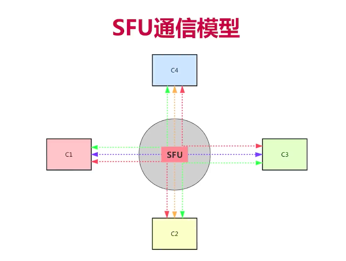
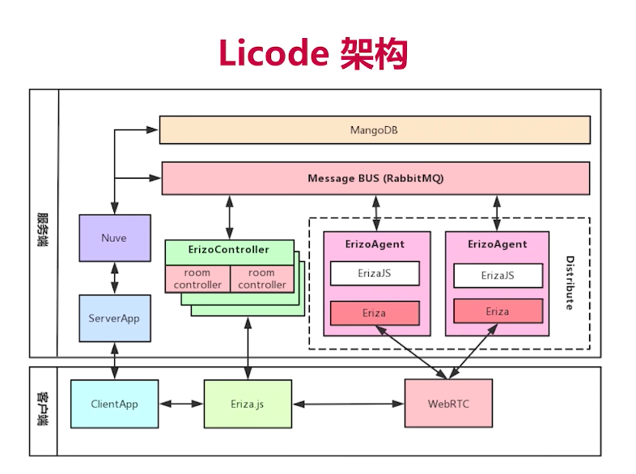
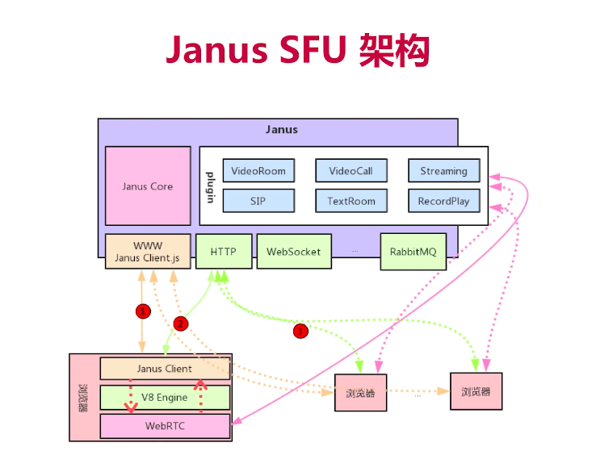
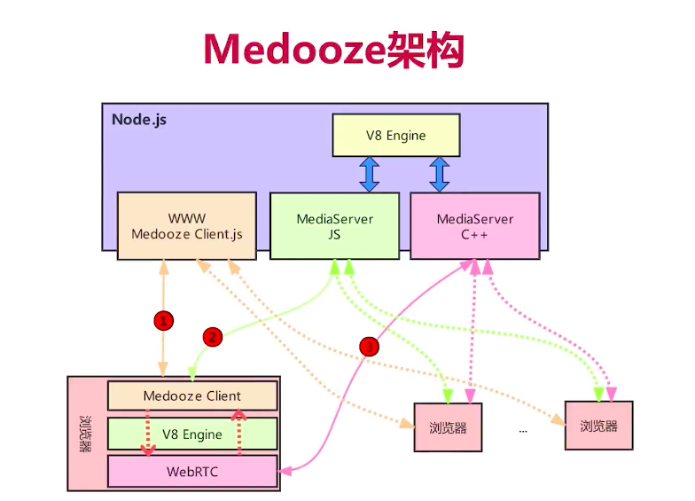
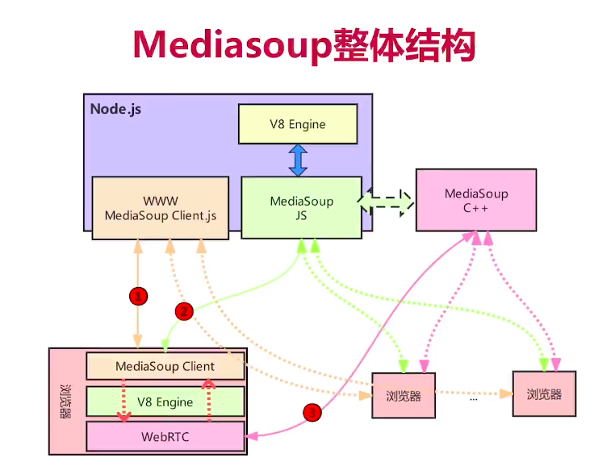

# webrtc

## 一、音视频架构选型

1. SFU架构说明

2. licode流媒体架构
> 缺点： 部署不方便

3. janus流媒体架构
> 缺点：代码中有用C语言实现的

4. medooze流媒体架构
> 缺点：代码中有用C语言实现的

5. mediasoup流媒体架构
> 性能最佳！架构最好！对于前端开发友好！

## 二、选用mediasoup架构进行开发

### 1、服务器环境
